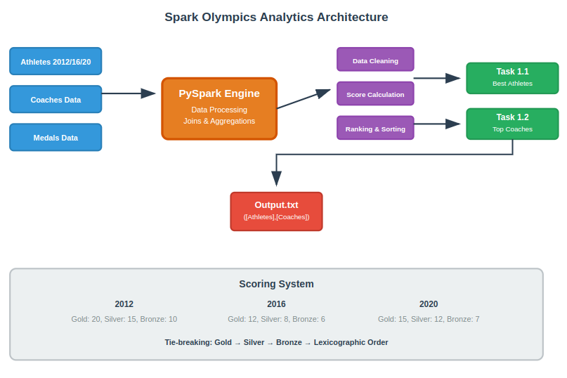

# Spark Olympics Analytics

A PySpark application that analyzes Olympic performance data from 2012, 2016, and 2020 to identify top athletes and international coaches for the IOC's centennial celebration.

This project processes Olympic datasets to:
- **Task 1.1**: Find the best athlete in each sport across all three Olympics
- **Task 1.2**: Identify top 5 international coaches from China, India, and USA

## Architecture Diagram



## 📊 Scoring System

| Year | Gold | Silver | Bronze |
|------|------|--------|--------|
| 2012 | 20   | 15     | 10     |
| 2016 | 12   | 8      | 6      |
| 2020 | 15   | 12     | 7      |

## 🚀 Usage

```bash
python task1.py athletes_2012.csv athletes_2016.csv athletes_2020.csv coaches.csv medals.csv output.txt
```

## 📤 Output Format

```
([ATHLETE_A,ATHLETE_B,...],[COACH_A,COACH_B,...])
```

- Athletes sorted alphabetically by sport
- Coaches grouped by country: China → India → USA

## 🔧 Key Features

- **Data Cleaning**: Handles dirty data and random casing
- **Multi-year Analysis**: Processes 2012, 2016, 2020 Olympics
- **Tie-breaking**: Gold > Silver > Bronze > Lexicographic order
- **International Coaching**: Tracks coaches across different countries

## ⚡ Requirements

- Apache Spark
- PySpark
- Python 3.x

## 🏆 Business Rules

- Coaches train one country per year (can switch countries)
- Athlete-coach sport matching required
- Only 2012, 2016, 2020 data considered
